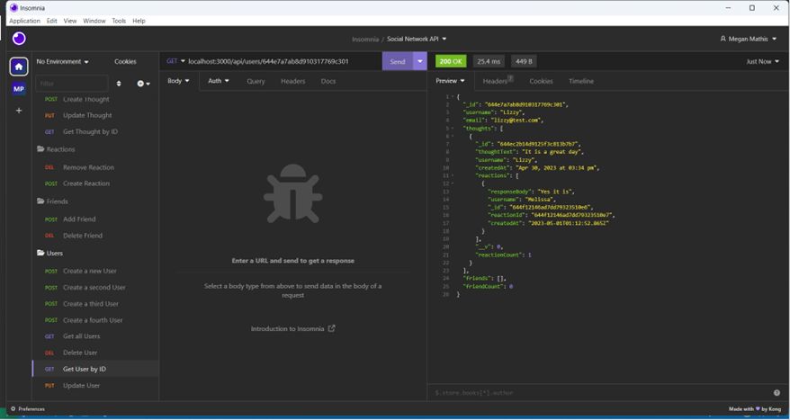
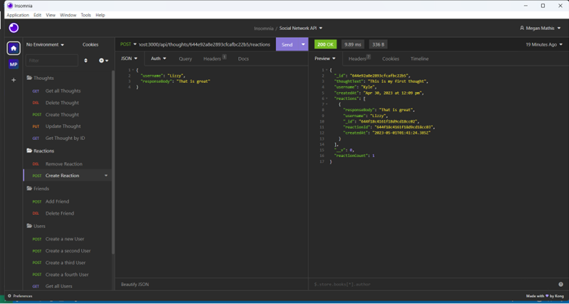

# Social_Network_API18 NoSQL: Social Network API

## Description

This application is a social network API. Users can make and delete friends, share their thoughts with their friends, and react to those thoughts.

## Table of Contents

- [Installation](#installation)
- [License](#license)
- [Usage](#usage)
- [ScreenShots](#screenshots)
- [Video](#video)
- [Links to Deployment](#linkstodeployment)
- [Credits](#LinkstoDeployment)
- [Contribution](#contribution)
- [Tests](#tests)
- [Questions](#questions)

## Installation

1. Clone the repo
2. npm install
3. npm start
4. Go to Insomnia to test API routes

## License

MIT

## Usage

1. Go to Insomnia
2. Test GET ALL Users and Thoughts
3. Test GET User and Thought by ID
4. Test POST User, Friend, Thought, and Reaction
5. Test PUT User and Thought
6. Test DELETE User, Thought, Friend, and Reaction

## ScreenShots

## Video

https://drive.google.com/file/d/1b6j5yCAcTnRvQJQ3uP7FjnCObzMrmG5P/view?usp=share_link

## Links to Deployment

https://github.com/MegMathis/Social_Network_API

## Credits

Ask BCS

https://www.mongodb.com/docs/manual/reference/method/js-cursor/

https://mongoosejs.com/docs/guide.html

https://mongoosejs.com/docs/schematypes.html

https://masteringjs.io/tutorials/mongoose/mongoose-validate-unique-email

https://gist.github.com/rupeshtiwari/acf770bfc85f3fe1f62a80b461abfc13

https://www.w3schools.com/jsref/jsref_now.asp

https://www.freecodecamp.org/news/javascript-date-now-how-to-get-the-current-date-in-javascript/

https://mongoosejs.com/docs/tutorials/getters-setters.html

https://mongoosejs.com/docs/middleware.html

https://momentjs.com/docs/

https://mongoosejs.com/docs/models.html#compiling

## Contribution

Megan Mathis

## Tests

n/a

## Questions

Any questions, please contact me at:

- GitHub:
  [MegMathis](http://github.com/MegMathis)
- Email:
  [mcdonough.megan25@gmail.com](mailto:mcdonough.megan25@gmail.com)
